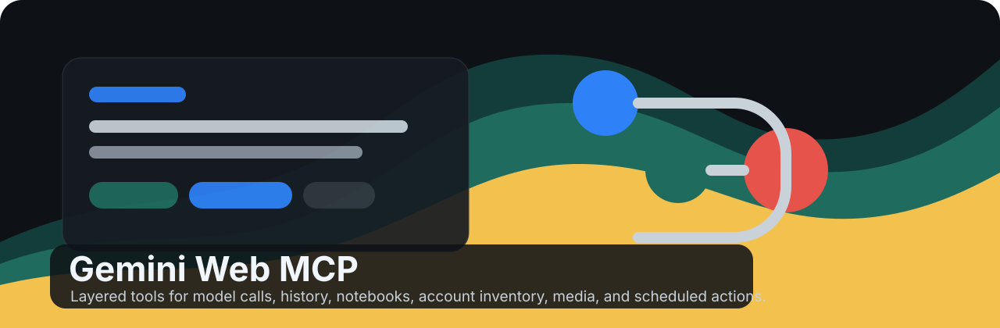

<p align="center">
  
</p>

<h1 align="center">Gemini Web MCP Server (v1.3.0)</h1>

<p align="center">
  <a href="https://github.com/Luckycat133/gemini-web-mcp/actions/workflows/ci.yml"></a>
  <a href="https://github.com/Luckycat133/gemini-web-mcp/tree/main/.agents/skills/gemini-web-mcp"></a>
  <a href="https://www.gnu.org/licenses/agpl-3.0.html"></a>
  <a href="docs/changelog.md"></a>
</p>

<p align="center">
  <a href="README.md">English</a> · <strong>简体中文</strong>
</p>

> ⚠️ 免责声明: 本项目仅供技术研究与教育用途。使用逆向工程方式访问 Gemini Web 可能违反 Google 服务条款，并存在账户被限制的风险。

基于 Gemini Web 网页版逆向工程的 MCP 服务器，支持 Claude Desktop、VS Code 等任何 MCP/Skills 兼容的 AI 应用。

---

## MCP 协议兼容性

本服务器通过专用 `MCPServer` 适配层，把 discovery、版本协商、JSON-RPC 帧、旧式 `initialize` 握手、结果校验和结构化协议错误委托给官方 `mcp` Python SDK v2。仓库不自建协议栈；`error_handler.py` 里的 `NO_COOKIE` / `INVALID_COOKIE` / `SESSION_NOT_FOUND` 等是工具结果中的应用层错误，不是 JSON-RPC 协议错误。

当前运行时支持范围是 `mcp>=2,<3` 与 `mcp-types>=2,<3`。CI 同时覆盖协议 `2026-07-28` 的 `server/discover` 客户端，以及通过 `2025-11-25` initialize 路径接入的兼容客户端。每个工具都声明 `outputSchema`，返回经过校验的 `structuredContent`，并保留现有文本。SDK v1 的维护截止日期和完整客户端兼容边界见 [兼容政策](docs/mcp-sdk-compatibility.md)。

---

## ✨ 主要功能

### 🤖 模型支持
- **flash-lite** → Web UI `3.1 Flash-Lite`
- **flash** / **fast** → Web UI `3.5 Flash`
- **pro** → Web UI `3.1 Pro`
- 上述三个模型都支持 `thinking_level=standard` / `extended`
- **thinking** 仍保留为旧兼容别名
- `learning_mode` 可触发网页 `学习辅导` companion：互动测验、抽认卡、模拟测试、备考/学习指南

### 🎨 媒体生成
- **图像**: 首轮生成固定为 Nano Banana 2；`pro` 只对应网页生成后的 Pro redo 语义
- **视频**: Veo 3.1 (最长60秒，所有模型)
- **音乐**: `flash` 系列 → Lyria 3，`pro` → Lyria 3 Pro

### 💬 对话功能
- 单次对话（支持图片输入，并可收集 Gemini 上游流）
- 多轮会话（可收集 Gemini 上游流）
- Temporary chat (不进入 Gemini 历史记录)
- 使用已保存 Gem 进行对话
- 学习模式 (`learning_mode=quiz` / `flashcards` / `practice_test` / `study_guide`)
- 会话管理

### 🖼️ 参考图像
- 媒体生成可附带参考图像
- 提示词可要求 Gemini 编辑或变换上传图像

### 🔧 管理功能
- Cookie 自动刷新
- Cookie 浏览器自动获取；macOS Keychain 等待有超时上限，不会无限挂起
- 智能错误处理

### 📦 Skill 分发
- 运行时 skill：`.agents/skills/gemini-web-mcp`
- 仓库开发 skill：`.agents/skills/gemini-web-mcp-development`
- `.agents/skills` 是唯一仓库来源，避免同时扫描 `.agents` 与 `.codex` 的客户端重复发现同名 skill
- 两个 skill 都可直接从 GitHub 安装，并在 CI 中验证
- Tag release 工作流构建 standalone skill zip、wheel 和源码包
- `docs/launch-kit.md` 提供社交媒体发布文案和分发清单

---

## 🚀 快速开始

### 0. 先做无需 Cookie 的一条命令验证

安装 [uv](https://docs.astral.sh/uv/) 后运行：

```bash
uvx --from git+https://github.com/Luckycat133/gemini-web-mcp@main gemini-mcp-onboarding
```

这条命令会在隔离环境中安装当前 `main` 源码、启动真实 stdio 服务器，并调用静态文本工具
`gemini_get_tool_manifest`。它会从子进程移除 Gemini Cookie，不会向 Gemini 发请求。需要不可变安装时，请把 `@main` 换成已审核的 commit SHA。

### 1. 获取 Cookie（仅实时 Gemini 调用需要）

#### 方法 1: 手动获取
1. 打开 Chrome，访问 [gemini.google.com](https://gemini.google.com) 并登录
2. F12 → Application → Cookies → https://gemini.google.com
3. 复制 `__Secure-1PSID` 的值 (必填)
4. 复制 `__Secure-1PSIDTS` 的值 (可选)

#### 方法 2: 自动从浏览器获取
```bash
pip install browser-cookie3
```
然后使用 MCP 工具 `gemini_get_cookie_from_browser(browser="chrome")`

macOS 首次读取可能弹出 Keychain 授权。默认最多等待 15 秒；未授权时返回脱敏错误，
可通过 `GEMINI_BROWSER_COOKIE_TIMEOUT_SECONDS` 调整等待上限。

### 2. 配置 (Claude Desktop / 其他 MCP 客户端)

编辑配置文件 (Claude Desktop):
- macOS: `~/Library/Application Support/Claude/claude_desktop_config.json`
- Windows: `%APPDATA%\Claude\claude_desktop_config.json`
- Linux: `~/.config/Claude/claude_desktop_config.json`

```json
{
  "mcpServers": {
    "gemini": {
      "command": "uvx",
      "args": [
        "--from",
        "git+https://github.com/Luckycat133/gemini-web-mcp@main",
        "gemini-mcp-server"
      ],
      "env": {
        "GEMINI_TOOLS": "model"
      }
    }
  }
}
```

Codex、Claude Desktop、Claude Code 和 VS Code 的完整可复制配置见
[客户端安装与验证](docs/client-examples.md)。

### 3. 从源码开发（可选）

```bash
git clone https://github.com/Luckycat133/gemini-web-mcp.git
cd gemini-web-mcp
python -m venv .venv
. .venv/bin/activate
pip install -e ".[all,dev]"
```

### 4. 启动服务器

```bash
# 只调用模型
GEMINI_TOOLS=model python -m src.server

# 只读整理历史
GEMINI_TOOLS=history python -m src.server

# 通用内容工作流
GEMINI_TOOLS=core python -m src.server

# 完整维护/验证工具面
GEMINI_TOOLS=all python -m src.server

# 安装后的主入口（等价于 python -m src.server）
GEMINI_TOOLS=core gemini-mcp-server

# 安装后的低 token facade 入口
gemini-mcp-skill-server
```

---

## 📦 环境变量

| 变量名 | 必填 | 说明 | 默认值 |
|--------|------|------|--------|
| GEMINI_PSID | ✅ | Cookie __Secure-1PSID | - |
| GEMINI_PSIDTS | ❌ | Cookie __Secure-1PSIDTS | - |
| GEMINI_PROXY | ❌ | 代理地址 | - |
| GEMINI_AUTO_REFRESH | ❌ | 自动刷新 Cookie | true |
| GEMINI_BROWSER_COOKIE_TIMEOUT_SECONDS | ❌ | macOS 浏览器 Cookie 读取等待 Keychain 的单次超时（秒） | 15 |
| GEMINI_TOOLS | ❌ | 加载的工具组 | core |
| GEMINI_CHAT_RETENTION_SECONDS | ❌ | 默认远端对话保留时间；到期自动删除，设为 0 表示尽快删除 | 1800 |

---

## 🔧 工具组 (分层加载)

| 工具组 | 包含功能 | 用途 | Token 消耗 |
|--------|---------|------|-----------|
| `model` / `chat` | 仅对话和会话工具 | 只想调用 Gemini 模型的 AI agent | 低 |
| `history` | `gemini_history` 聚合 list/scan/search/read/export + manifest | 只整理或导出对话历史，不暴露删除/账号写操作 | 低 |
| `history-organize` | `gemini_history` + `gemini_notebooks` + Notebook move | 把选定对话整理进 Gemini 原生 Notebook | 中 |
| `account-read` | `gemini_account_inventory` 聚合账号只读盘点 | 账号能力和 Web surface 审计 | 低 |
| `scheduled-admin` | scheduled list/get/create/delete | 明确授权后管理定时操作 | 中 |
| `core` | 对话 + 媒体 + 文件/URL + Deep Research | 通用内容工作流 | 中 |
| `manage` | 聚合入口 + 历史、账号、scheduled、Gems 颗粒工具 | 兼容旧配置；普通 agent 不建议默认使用 | 高 |
| `prompts` | 本地提示词库存取 | 可选附加能力 | 低 |
| `all` | `core` + `manage` | 完整维护/验证工具面 | 高 |

文本调用优先从 `model` 开始；图片、视频、音乐、文件、URL 或 Deep Research 使用 `core`；
需要固定十一工具、低 token facade 时使用 `gemini-mcp-skill-server`；`all` 只适合维护验证，不是通用默认值。

---

## 🛠️ 可用工具

### 当前工具清单

按当前代码和 `list_tools()` 实际输出整理如下。

#### 默认启用 (`GEMINI_TOOLS=core`)

- `gemini_chat`
- `gemini_chat_stream`
- `gemini_start_chat`
- `gemini_send_message`
- `gemini_send_message_stream`
- `gemini_list_sessions`
- `gemini_reset_session`
- `gemini_generate_media`
- `gemini_generate_music`
- `gemini_upload_file`
- `gemini_analyze_url`
- `gemini_deep_research`
- `gemini_list_research_report_actions`
- `gemini_create_from_research_report`
- `gemini_get_tool_manifest`
- `gemini_doctor`
- `gemini_get_cookie_status`
- `gemini_list_browser_cookie_profiles`
- `gemini_get_cookie_from_browser`
- `gemini_reset`

#### 可选启用

`GEMINI_TOOLS=all` 会在 `core` 基础上增加：

- `gemini_history`
- `gemini_account_inventory`
- `gemini_notebooks`
- `gemini_cleanup_test_artifacts`
- `gemini_list_chats`
- `gemini_scan_chat_history_sources`
- `gemini_search_chats`
- `gemini_read_chat`
- `gemini_export_chat`
- `gemini_delete_chat`
- `gemini_inspect_account`
- `gemini_get_web_capabilities`
- `gemini_probe_web_features`
- `gemini_list_public_links`
- `gemini_get_usage_limits`
- `gemini_list_library_capabilities`
- `gemini_list_notebooks`
- `gemini_list_notebook_chats`
- `gemini_move_chat_to_notebook`
- `gemini_list_scheduled_actions`
- `gemini_get_scheduled_action`
- `gemini_create_scheduled_action`
- `gemini_delete_scheduled_action`
- `gemini_get_tool_mode_status`
- `gemini_list_models`
- `gemini_manage_gems`

更窄的常用配置：

- `GEMINI_TOOLS=model`: 只调用模型，不暴露媒体、文件、历史或账号工具
- `GEMINI_TOOLS=history`: 暴露 `gemini_history`，只读整理历史，不暴露删除、scheduled 写操作或 Gems
- `GEMINI_TOOLS=history-organize`: 在 `history` 基础上增加 `gemini_notebooks` 和 move 到 native Notebook
- `GEMINI_TOOLS=account-read`: 暴露 `gemini_account_inventory`，只读盘点账号 Web surface
- `GEMINI_TOOLS=scheduled-admin`: 只暴露定时操作 list/get/create/delete

`GEMINI_TOOLS=prompts` 会额外提供：

- `gemini_manage_prompts`

#### 已移除 / 不再单独暴露

- `gemini_list_features` 已移除
- 独立图片工具不再单独暴露，统一合并到 `gemini_generate_media`

### 对话工具
- `gemini_chat`: 单次对话
- `gemini_chat_stream`: 收集单次对话的 Gemini 上游流，归一化后一次性返回 MCP 结果
- `gemini_start_chat`: 创建多轮会话，可指定 Gem 和 Temporary chat
- `gemini_send_message`: 会话消息，可沿用或覆盖 Temporary chat
- `gemini_send_message_stream`: 收集会话的 Gemini 上游流，归一化后一次性返回 MCP 结果
- `gemini_list_sessions`: 列会话
- `gemini_reset_session`: 重置会话

对话工具支持 `thinking_level=standard|extended`，并可选
`learning_mode=interactive_quiz|flashcards|practice_test|study_guide` 来对齐
Gemini Web `学习辅导` 输入模式。

默认情况下，工具调用产生的 Gemini 网页端对话会在一段时间后自动删除。需要保留时传入 `retain_chat=true`；需要调整本次调用保留时间时传入 `delete_after_seconds`。

### 媒体工具
- `gemini_generate_media`: 图像/视频/音乐生成；视频/音乐是 Gemini Web 长任务，建议设置较长 `timeout_seconds`
- `gemini_generate_music`: 音乐生成便捷工具；默认走 `flash` → Lyria 3

### 文件和 URL
- `gemini_upload_file`: 上传并分析本地文件
- `gemini_analyze_url`: 分析网页或 YouTube 等 URL

### Deep Research
- `gemini_deep_research`: 创建研究计划、启动研究，并返回结构化的 `queued` / `running` / `completed` / `timed_out` 状态；`wait_for_completion=false` 可只启动不等待

### 账户和内容管理
- `gemini_history`: 历史对话只读聚合入口，支持 `action=list|scan|search|read|export`
- `gemini_account_inventory`: 账号 Web surface 只读聚合入口，支持 capabilities/status/features/links/usage/library/notebooks/scheduled/modes/models
- `gemini_notebooks`: Gemini Web 原生笔记本只读聚合入口，支持 `action=list|chats`
- `gemini_inspect_account`: 检查当前账号 Web RPC/能力状态
- `gemini_get_tool_manifest`: 返回工具安全/隐私/分页/推荐工作流清单，供 agent 规划调用
- `gemini_get_web_capabilities`: 返回实测 Pro 网页模型、思考等级、工具菜单、设置入口和 MCP 覆盖清单
- `gemini_list_chats`: 分页列出历史对话元数据
- `gemini_search_chats`: 分页搜索历史对话标题/ID；显式 `scan_turns=true` 时才读取正文匹配
- `gemini_read_chat`: 读取指定历史对话内容
- `gemini_export_chat`: 将单个历史对话导出为 Markdown 或 JSON
- `gemini_delete_chat`: 请求删除指定历史对话；只有完整刷新 recent/pinned 历史元数据并确认 ID 不可见时才报告 `verified_absent`，无新鲜回读能力时明确标为未验证
- `gemini_cleanup_test_artifacts`: dry-run 或删除匹配显式 marker 的测试聊天/定时任务；`scan_turns=true` 时才读取正文。Gemini 自动标题可能不保留 prompt marker，因此测试时还应记录返回的远端 ID
- `gemini_probe_web_features`: 探测 Library、公开链接、用量、个性化、记忆导入等新版 Web 入口的只读 RPC 可达性
- `gemini_list_public_links`: 列出“你的公开链接”页面返回的公开链接
- `gemini_get_usage_limits`: 读取用量限额页面的限额/模型状态结构
- `gemini_list_library_capabilities`: 列出 Library 页面暴露的本地化能力/模板条目
- `gemini_list_scheduled_actions`: 只读列出“定时操作”页面返回的任务条目
- `gemini_get_scheduled_action`: 按 ID 只读获取单个“定时操作”，用于创建后或已知 ID 的二次校验
- `gemini_create_scheduled_action`: 创建每天固定小时触发的“定时操作”
- `gemini_delete_scheduled_action`: 按 ID 删除“定时操作”（不会删除已产生的历史对话）
- 定时操作 create 会返回 `visible_in_registry` / `verification_status`，delete 会返回
  `verification_status` / `visible_after_delete` / `deleted_by_id_after_delete`；
  list 会在空 registry 时返回 cookie/session 诊断，帮助识别 Chrome 多账号上下文不一致
- 从 Chrome 获取 Cookie 时会隔离 gemini_webapi 的本地 cookie cache，并优先选择
  scheduled registry 可见的本地 profile，避免旧 cache 或多账号 profile 导致列表为空
- `gemini_get_tool_mode_status`: 读取 Gemini Web 工具/模式状态枚举
- `gemini_list_models`: 列出可用模型说明
- `gemini_manage_gems`: Gems 的 list/create/update/delete

### Cookie 管理
- `gemini_doctor`: 只读预检工具组、Cookie 状态、浏览器 profile 对齐和媒体校验依赖，不输出 Cookie 值
- `gemini_get_cookie_status`: 查看 Cookie 状态
- `gemini_list_browser_cookie_profiles`: 列出本地浏览器 profile 诊断，包括 Chrome 当前选中 profile，不输出 Cookie 值；Keychain 超时返回 `BROWSER_COOKIE_ACCESS_TIMEOUT`
- `gemini_get_cookie_from_browser`: 从浏览器或指定 profile 自动获取 Cookie；受同一 Keychain 超时保护

### 管理工具
- `gemini_reset`: 重置客户端

### 低 token Skill 入口
`src.skill_server` 提供更短工具名的 skills 兼容入口，适合希望减少工具描述 token 的客户端：

安装 wheel 或 editable package 后可直接运行 `gemini-mcp-skill-server`；
`python -m src.skill_server` 仍保持兼容。

- `chat`: 对话
- `create`: 图片/视频/音乐生成
- `edit`: 图片编辑
- `session`: 本地多轮会话
- `history`: Gemini Web 历史对话 list/search/read/export/delete
- `cleanup`: 默认 dry-run 清理匹配 marker 的测试聊天和测试定时任务
- `account`: 账号状态、工具清单、模型列表、功能探测、公开链接、用量、Library 能力和定时操作
- `scheduled`: 定时操作 list/get/create/delete，create 仅支持每日固定小时
- `prompts`: 本地提示词库
- `cookie`: Cookie 状态和浏览器获取

### 运行时 Skill 与开发 Skill
`.agents/skills/gemini-web-mcp` 只指导 agent 安全操作已安装的 MCP 工具；
`.agents/skills/gemini-web-mcp-development` 用于修改本仓库的架构、测试、打包、兼容性和发布。
不要用运行时 skill 指导开发工作。

使用跨 agent 的 `skills` CLI 从 GitHub 一行安装：

```bash
npx --yes skills@1.5.21 add \
  https://github.com/Luckycat133/gemini-web-mcp \
  --skill gemini-web-mcp \
  --agent codex --copy --yes
```

仓库贡献者安装开发 skill：

```bash
npx --yes skills@1.5.21 add \
  https://github.com/Luckycat133/gemini-web-mcp \
  --skill gemini-web-mcp-development \
  --agent codex --copy --yes
```

两个 skill 都不安装 MCP server 本体；服务器仍按上面的 `uvx` 或源码步骤运行。

---

## 🛡️ 智能错误处理

内置智能错误处理，让 AI 可以自主解决常见问题：

| 错误类型 | 自动解决方案 | 建议工具 |
|---------|-------------|---------|
| 无 Cookie | 提示设置 PSID 或从浏览器获取 | `gemini_get_cookie_from_browser` |
| Cookie 过期 | 提示更新 Cookie | `gemini_get_cookie_from_browser` |
| 会话不存在 | 提示创建会话 | `gemini_start_chat` |
| 模型不可用 | 提示切换模型 | `gemini_list_models` |
| 网络错误 | 提示检查网络/代理 | - |
| 限流 | 提示稍后重试 | - |
| 图片加载失败 | 提示检查路径/安装 pillow | - |

---

## 📁 项目结构

```
gemini-mcp-server/
├── pyproject.toml          # 项目配置
├── README.md               # 使用文档
├── .env.example            # 环境变量示例
├── src/
│   ├── __init__.py
│   ├── server.py           # MCP 服务器主入口（primary surface）
│   ├── skill_server.py     # 低 token skill 服务器（facade surface）
│   ├── onboarding.py       # 公开安装、文本调用与本地图像产物验证客户端
│   ├── client_wrapper.py   # Gemini 客户端封装
│   ├── client_manager.py   # 客户端生命周期管理
│   ├── cookie_manager.py   # Cookie 管理模块
│   ├── session_manager.py  # 本地会话管理
│   ├── thinking_client.py  # Thinking/Learning 模式传输层
│   ├── error_handler.py    # 智能错误处理
│   ├── constants.py        # 模型常量、配置
│   ├── remote_chat_cleanup_manager.py  # 远程聊天清理
│   └── tools/              # 工具集
│       ├── __init__.py     # 分层加载入口
│       ├── annotations.py  # MCP 工具安全/隐私注解常量
│       ├── manifest_data.py # 静态 manifest 数据（UI 能力/RPC probe/工具清单）
│       ├── utils.py        # 共享工具函数
│       ├── chat.py         # 对话工具
│       ├── media.py        # 媒体生成
│       ├── image.py        # media.py 向后兼容别名
│       ├── file.py         # 文件和 URL 工具
│       ├── manage.py       # 聊天、模型、Gems 管理
│       ├── research.py     # Deep Research
│       └── prompts.py      # 预设提示词库
└── tests/                  # 测试
```

---

## 🔬 开发与调试

安装开发依赖:
```bash
pip install -e ".[all,dev]"
```

测试导入:
```bash
python -c "import sys; sys.path.insert(0, '.'); from src import client_wrapper, constants; print('✓ OK')"
```

运行测试与 MCP contract evaluation:
```bash
pytest -q
```

`evaluations/gemini_web_mcp_contract.xml` 提供 17 个只读、稳定答案的 MCP 评估问题，
覆盖工具安全清单、历史记录工作流、Web 能力映射和分页/隐私元数据。

构建发布包:
```bash
python -m build
```

使用 MCP Inspector 调试:
```bash
pip install "mcp[cli]"
mcp dev src/server.py
```

---

## 📍 开发状态

当前基线可用，但开发 skill 不是已经全部完成的功能清单。history 的 list/search/read/export/delete 已在
primary/compact 间共享 typed result，删除只有在回读确认后才算已验证。2026-08-08 的一次显式授权定向实机
测试已验证 Cookie 初始化、temporary/retained 文本、多轮上下文、两套入口的 typed history，以及所有测试
聊天的 `verified_absent` 删除；该测试不是专用账号全量 canary，也未覆盖媒体、文件、URL、Deep Research
或账号 mutation。仍需完成更广的 live 基线、其他管理动作的 typed result、跨重启持久化 cleanup，以及
共享的长任务 job API。
源码版本继续保持 `1.3.0`；由于历史上已经存在更高 tag，下一个公开版本线需要 owner 明确决定。

完整的“已实现 / 部分完成 / 延后 / owner 决策”边界见
[开发状态与下一步](docs/development-status.md)。离线 CI 和打包通过不等于已经观察到当前 Gemini Web 行为。

---

## ⚠️ 限制与注意事项

- AI Plus 功能需要订阅 (Pro 模型)
- 免费账户有每日配额限制
- Cookie 需要定期更新
- 部分功能可能有地区限制
- 建议使用独立的 Google 账户进行研究

---

## 📖 参考项目

- [HanaokaYuzu/Gemini-API](https://github.com/HanaokaYuzu/Gemini-API) - 核心逆向工程库

---

## 📄 许可证

AGPL-3.0
